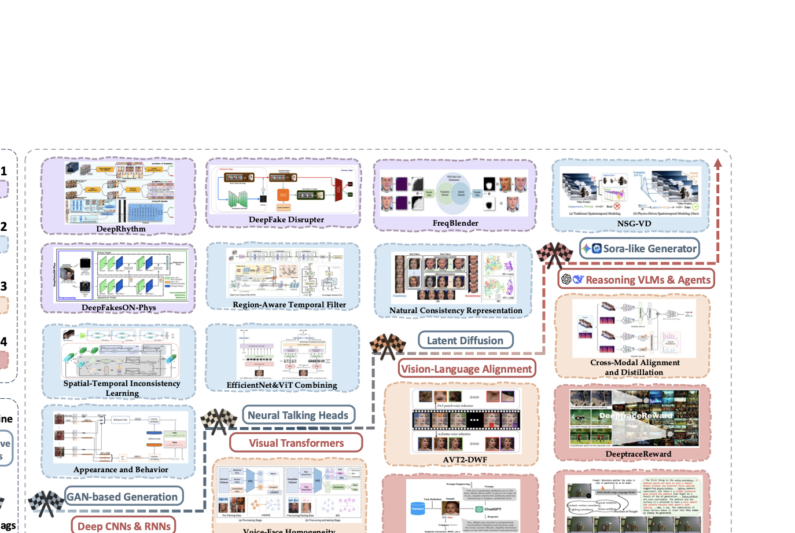

# Detection Methods

[Back to home](../README.md)

  

This section reorganizes the detection part of the survey into the **four-layer taxonomy**. Each layer page contains representative papers grouped by the same subcategories used in the paper tables, plus an extra list of additional cited works discussed in the text.

## Layer Index

| Layer | View | Representative methods | Subcategories | Page |
| --- | --- | --- | --- | --- |
| L1 | Visual | 28 | A. Pixel and geometric artifacts / B. Physiological features / C. Distribution discrepancy and robustness | [Open](layer-1-intrinsic-cues.md) |
| L2 | Visual | 39 | A. Temporal and motion inconsistencies / B. Physical and frequency artifacts / C. Human behavioral and interaction dynamics | [Open](layer-2-spatiotemporal.md) |
| L3 | Language | 33 | A. Audio-visual consistency detection / B. Text-video semantic consistency reasoning / C. Robust learning and temporal localization | [Open](layer-3-cross-modal.md) |
| L4 | Language | 19 | A. Prompts and adapters for representation calibration / B. Tool-augmented agents for evidence gathering / C. Post-training, preferences and rewards | [Open](layer-4-world-level-reasoning.md) |

## Protocol-Aware Performance Snapshot

The numbers below come from the survey's compact AUC table. They are useful as a quick anchor, but **cross-dataset (CD)** and **in-domain (ID)** results should not be compared as if they were one unified leaderboard.

| Method | Layer | Protocol | [CDFv2](https://doi.org/10.1109/CVPR42600.2020.00327) | [DFDCP](https://arxiv.org/abs/1910.08854) | [DFDC](https://arxiv.org/abs/2006.07397) |
| --- | --- | --- | --- | --- | --- |
| [FreqBlender](https://arxiv.org/abs/2404.13872) | L1 | CD | 94.6 | 87.6 | 74.6 |
| [SeeABLE](https://doi.org/10.1109/ICCV51070.2023.01921) | L1 | CD | 87.3 | 86.3 | 75.9 |
| [LSDA](https://doi.org/10.1109/CVPR52733.2024.00858) | L1 | CD | 83.0 | 81.5 | 73.6 |
| [Style Latent Flows](https://doi.org/10.1109/CVPR52733.2024.00114) | L1 | CD | 89.0 | -- | -- |
| [TALL-Swin](https://openaccess.thecvf.com/content/ICCV2023/papers/Xu_TALL_Thumbnail_Layout_for_Deepfake_Video_Detection_ICCV_2023_paper.pdf) | L2 | CD | 90.8 | -- | 76.8 |
| [LipForensics](https://openaccess.thecvf.com/content/CVPR2021/papers/Haliassos_Lips_Dont_Lie_A_Generalisable_and_Robust_Approach_To_Face_CVPR_2021_paper.pdf) | L2 | CD | 82.4 | -- | 73.5 |
| [Two-branch](https://doi.org/10.1007/978-3-030-58571-6_39) | L2 | CD | 76.6 | -- | -- |
| [MDS](https://arxiv.org/abs/2005.14405) | L3 | ID | -- | -- | 90.6 |
| [RepDFD](https://ojs.aaai.org/index.php/AAAI/article/view/32559) | L4 | CD | 89.9 | 95.0 | 81.0 |
| [LVLMDFD](https://proceedings.mlr.press/v267/yu25d.html) | L4 | CD | 94.3 | 92.4 | 77.0 |
